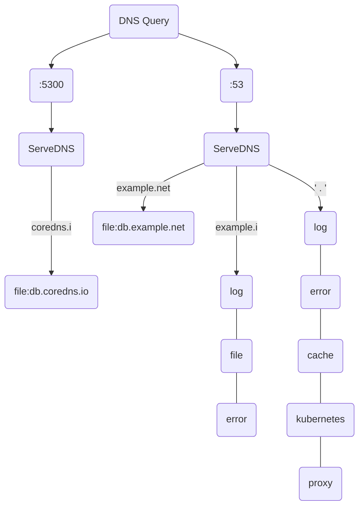

# CoreDns插件NodeLocal DNSCache  

## CoreDNS简介

CoreDNS插件是一款通过链式插件的方式为Kubernetes提供域名解析服务的DNS服务器。

### CoreDns配置文件Corefile说明

#### Corefile语法

```
.:5300 {
    bind 168.255.10.20
    nodecache skipteardown
    forward . 8.8.8.8:53 {
        force_tcp
    }
}

ctyun.cn:5301 {
    log
    errors
    cache 30
    file /etc/coredns/ctyun.cn.db
}
```

* ```.```: 表示全局配置区块.这里是全局配置区块,用于定义通用的配置,会应用于没有匹配到特定域名的查询请求.
* ```log```:表示启用日志记录插件.日志记录插件用于记录 CoreDNS 的日志信息.
* ```errors```:表示启用错误处理插件.错误处理插件用于处理 DNS 查询的错误情况.
* ```forward . 8.8.8.8```:表示将未能匹配到的查询请求转发到公共 DNS 服务器 8.8.8.8.这里的 . 表示匹配任意域名.
* ```cache 30```:表示启用缓存插件，并设置缓存的时间为 30 秒.缓存插件会缓存 DNS 查询的结果，以提高响应速度.
* ```ctyun.cn```:表示一个区块，用于匹配查询请求的域名是否为 ctyun.cn.如果查询请求的域名匹配 ctyun.cn,将使用该区块中的配置来处理.
* ```file /etc/coredns/ctyun.cn.db```:表示使用文件插件,将 ctyun.cn 域名的解析规则配置在 /etc/coredns/ctyun.cn.db 文件中.该文件应包含对应域名的 DNS 记录信息.

#### 举例说明

```
coredns.io:5300 {
    file db.coredns.io
}

example.io:53 {
    log
    errors
    file db.example.io
}

example.net:53 {
    file db.example.net
}

.:53 {
    kubernetes
    forward . 8.8.8.8
    log 
    errors
    cache
}
```



## NodeLocal DNSCache

NodeLocal DNSCache 通过在集群节点上作为 DaemonSet 运行 DNS 缓存代理来提高集群 DNS 性能。 在当今的体系结构中，运行在 'ClusterFirst' DNS 模式下的 Pod 可以连接到 kube-dns serviceIP 进行 DNS 查询。 通过 kube-proxy 添加的 iptables 规则将其转换为 kube-dns/CoreDNS 端点。 借助这种新架构，Pod 将可以访问在同一节点上运行的 DNS 缓存代理，从而避免 iptables DNAT 规则和连接跟踪。 本地缓存代理将查询 kube-dns 服务以获取集群主机名的缓存缺失（默认为 "cluster.local" 后缀）。

### 架构图

* 已注入DNS本地缓存的Pod，默认会通过NodeLocal DNSCache监听于节点上的IP（169.254.20.10）解析域名。
* NodeLocal DNSCache本地若无缓存应答解析请求，则会通过kube-dns服务请求CoreDNS进行解析。
* 已注入DNS本地缓存的Pod，当无法连通NodeLocal DNSCache时，会继而直接通过kube-dns服务连接到CoreDNS进行解析，此链路为备用链路。
* 未注入DNS本地缓存的Pod，会通过标准的kube-dns服务链路连接到CoreDNS进行解析。  

### 实现插件代码

实现步骤：  

* 在coredns/plugin目录下创建名称nodeCache插件的package.  
* 在package 下,创建 setup.go,在其中的 init 方法中,做插件配置工作(init 调用 setup 方法).  
* setup 方法中做3个事情:参数解析;实例化插件实体;将插件实体注册到CoreDNS中.
* 实现插件实现：实现ServeDNS和Name方法.
* 更改plugin.cfg文件添加你的插件，执行go generate coredns.go生成代码，最后执行go build(或者make)构建.

#### 在coredns/plugin目录下创建自己的插件 package

```
[root@myhost nodecache]# pwd
../coredns/plugin/nodecache
```

#### 在package 下,创建 setup.go,在其中的 init 方法中,做插件配置工作

``` go
var log = clog.NewWithPlugin("nodecache")

func init() {
 caddy.RegisterPlugin("nodecache", caddy.Plugin{
  ServerType: "dns",
  Action:     setup,
 })
}
```

#### setup方法

##### 参数解析

``` go
type config struct {
 port          int
 ifName        string
 localIPs      []net.IP
 setupIPTables bool
 skipTeardown  bool
}
```

上面的结构体为实现插件nodecache的类：

* `port`为监听端口号  
* `ifName`为创建的虚拟网卡名称  
* `localIPs`为监听的ip地址  
* `skipTeardown`表示删除插件时是否删除创建的虚拟节点

参数解析的主要作用就是按照CoreFile文件中的配置初始化config结构体实例中的各个参数，以如下的配置举例说明：  
configFile配置：`nodecache skipteardown`

``` go
func setup(c *caddy.Controller) error {
 cfg := getDefaultCfg()
 cfg.skipTeardown = shouldSkipTearDown(c)
 if cfg.parseSrvConfig(dnsserver.GetConfig(c)) != nil {
  log.Errorf("Error while parsing server config")
  return plugin.Error("nodecache", c.ArgErr())
 }
  ...
}

func shouldSkipTearDown(c *caddy.Controller) bool {
 for c.Next() {
  for c.NextArg() {
   if strings.ToLower(c.Val()) == "skipteardown" {
    return true
   }
  }
 }

 return false
}
```

首先，Coredns会将CoreFile文件中的配置`nodecache skipteardown`转换为`*caddy.Controller`结构体中的各个变量的值，通过参数传递给`setup`函数，然后通过c.Next()和c.NextArg()函数针对需要的参数进行判断，然后赋值给Config结构体中的对应变量；  
在本例中，执行完c.Next()后，c.Val()的值为nodecache，再执行完c.NextArg()后，c.Val()的值为skpteardown，然后通过判断，将Config变量中的skipTeardown进行对应的赋值。  
通过这种方式，就实现了coredns配置文件中的参数值传递到插件中的对应参数值。

##### 创建虚拟网卡

``` go
func setup(c *caddy.Controller) error {
  ...
 nl := netlink.Handle{}
 if exists, err := EnsureDummyDevice(&nl, cfg.ifName, cfg.localIPs, netlink.AddrAdd); err != nil {
  return plugin.Error("nodecache", fmt.Errorf("failed to create dummy interface: %s", err))
 } else if !exists {
  log.Infof("Added interface - %s", cfg.ifName)
 }
  ...
}
```

##### 创建iptables规则

``` go
func setup(c *caddy.Controller) error {
  ...
 ipt, err := iptables.New()
 if err != nil {
  return plugin.Error("nodecache", fmt.Errorf("failed to create iptables context: %s", err))
 }

 rules := iptablesRules(cfg.localIPs, cfg.port)
 for _, rule := range rules {
  if err = ipt.AppendUnique(rule.table, rule.chain, rule.rulespec...); err != nil {
   return plugin.Error("nodecache", fmt.Errorf("failed to create iptable rule: %s", err))
  }
 }
  ...
}

func iptablesRules(localIPs []net.IP, localPort int) []rule {
 r := make([]rule, 0)
 slocalPort := strconv.Itoa(localPort)

 for _, localIP := range localIPs {
  slocalIP := localIP.String()
  r = append(r, NewRule("raw", "PREROUTING", "-p", "tcp", "-d", slocalIP, "--dport", slocalPort, "-j", "NOTRACK", "-w"))
  r = append(r, NewRule("raw", "PREROUTING", "-p", "udp", "-d", slocalIP, "--dport", slocalPort, "-j", "NOTRACK", "-w"))
  r = append(r, NewRule("filter", "INPUT", "-p", "tcp", "-d", slocalIP, "--dport", slocalPort, "-j", "ACCEPT", "-w"))
  r = append(r, NewRule("filter", "INPUT", "-p", "udp", "-d", slocalIP, "--dport", slocalPort, "-j", "ACCEPT", "-w"))
  r = append(r, NewRule("raw", "OUTPUT", "-p", "tcp", "-s", slocalIP, "--sport", slocalPort, "-j", "NOTRACK", "-w"))
  r = append(r, NewRule("raw", "OUTPUT", "-p", "udp", "-s", slocalIP, "--sport", slocalPort, "-j", "NOTRACK", "-w"))
  r = append(r, NewRule("filter", "OUTPUT", "-p", "tcp", "-s", slocalIP, "--sport", slocalPort, "-j", "ACCEPT", "-w"))
  r = append(r, NewRule("filter", "OUTPUT", "-p", "udp", "-s", slocalIP, "--sport", slocalPort, "-j", "ACCEPT", "-w"))
 }

 return r
}
```

### 部署NodeLocal DNSCache

#### 创建sc

```yaml
apiVersion: v1
kind: ServiceAccount
metadata:
  name: node-local-dns
  namespace: kube-system
  labels:
    kubernetes.io/cluster-service: "true"
    addonmanager.kubernetes.io/mode: Reconcile
```

#### 创建svc

```yaml
apiVersion: v1
kind: Service
metadata:
  name: kube-dns-upstream
  namespace: kube-system
  labels:
    k8s-app: kube-dns
    kubernetes.io/cluster-service: "true"
    addonmanager.kubernetes.io/mode: Reconcile
    kubernetes.io/name: "KubeDNSUpstream"
spec:
  ports:
  - name: dns
    port: 53
    protocol: UDP
    targetPort: 53
  - name: dns-tcp
    port: 53
    protocol: TCP
    targetPort: 53
  selector:
    k8s-app: kube-dns
```

此service的endpoints和kube-dns的相同，这里有一个疑问，为什么要创建一个相同的服务，这是因为在kubeproxy运行在iptables模式的时候，请求kube-dns时会进行DNAT，但是我们不想做过多的NAT，所以在这种模式的时候，nodecache会监听两个地址，指定的虚拟端口IP地址和kube-DNS的serviceIP，这样在创建iptables规则的时候，会增加一条针对kube-DNS serviceIP的NOTRACK规则，这样到这个地址的数据包就不会进行DNAT，而是直接到达我们的虚拟接口进行了DNS解析请求。为了避免和kube-DNS service混淆，所以这里需要新增了一个service。
原理图如下：

#### 创建cm

```yaml
apiVersion: v1
kind: ConfigMap
metadata:
  name: node-local-dns
  namespace: kube-system
  labels:
    addonmanager.kubernetes.io/mode: Reconcile
data:
  Corefile: |
    __PILLAR__DNS__DOMAIN__:53 {
        errors
        cache {
                success 9984 30
                denial 9984 5
        }
        reload
        loop
        bind __PILLAR__LOCAL__DNS__ __PILLAR__DNS__SERVER__ #nodecache监听的IP地址
        forward . __PILLAR__CLUSTER__DNS__ {  #KUBE_DNS 的service ip
                force_tcp
        }
        prometheus :9253
        health __PILLAR__LOCAL__DNS__:8080
        }
    in-addr.arpa:53 {
        errors
        cache 30
        reload
        loop
        bind __PILLAR__LOCAL__DNS__ __PILLAR__DNS__SERVER__
        forward . __PILLAR__CLUSTER__DNS__ {
                force_tcp
        }
        prometheus :9253
        }
    ip6.arpa:53 {
        errors
        cache 30
        reload
        loop
        bind __PILLAR__LOCAL__DNS__ __PILLAR__DNS__SERVER__
        forward . __PILLAR__CLUSTER__DNS__ {
                force_tcp
        }
        prometheus :9253
        }
    .:53 {
        errors
        cache 30
        reload
        loop
        bind __PILLAR__LOCAL__DNS__ __PILLAR__DNS__SERVER__
        forward . __PILLAR__UPSTREAM__SERVERS__
        prometheus :9253
        }
```

#### 创建daemonset

```yaml
apiVersion: apps/v1
kind: DaemonSet
metadata:
  name: node-local-dns
  namespace: kube-system
  labels:
    k8s-app: node-local-dns
    kubernetes.io/cluster-service: "true"
    addonmanager.kubernetes.io/mode: Reconcile
spec:
  updateStrategy:
    rollingUpdate:
      maxUnavailable: 10%
  selector:
    matchLabels:
      k8s-app: node-local-dns
  template:
    metadata:
      labels:
        k8s-app: node-local-dns
      annotations:
        prometheus.io/port: "9253"
        prometheus.io/scrape: "true"
    spec:
      priorityClassName: system-node-critical
      serviceAccountName: node-local-dns
      hostNetwork: true
      dnsPolicy: Default  # Don't use cluster DNS.
      tolerations:
      - key: "CriticalAddonsOnly"
        operator: "Exists"
      - effect: "NoExecute"
        operator: "Exists"
      - effect: "NoSchedule"
        operator: "Exists"
      containers:
      - name: node-cache
        image: registry.k8s.io/dns/k8s-dns-node-cache:1.22.23
        resources:
          requests:
            cpu: 25m
            memory: 5Mi
        args: [ "-localip", "__PILLAR__LOCAL__DNS__,__PILLAR__DNS__SERVER__", "-conf", "/etc/Corefile", "-upstreamsvc", "kube-dns-upstream" ]
        securityContext:
          capabilities:
            add:
            - NET_ADMIN
        ports:
        - containerPort: 53
          name: dns
          protocol: UDP
        - containerPort: 53
          name: dns-tcp
          protocol: TCP
        - containerPort: 9253
          name: metrics
          protocol: TCP
        livenessProbe:
          httpGet:
            host: __PILLAR__LOCAL__DNS__
            path: /health
            port: 8080
          initialDelaySeconds: 60
          timeoutSeconds: 5
        volumeMounts:
        - mountPath: /run/xtables.lock
          name: xtables-lock
          readOnly: false
        - name: config-volume
          mountPath: /etc/coredns
        - name: kube-dns-config
          mountPath: /etc/kube-dns
      volumes:
      - name: xtables-lock
        hostPath:
          path: /run/xtables.lock
          type: FileOrCreate
      - name: kube-dns-config
        configMap:
          name: kube-dns
          optional: true
      - name: config-volume
        configMap:
          name: node-local-dns
          items:
            - key: Corefile
              path: Corefile.base
```

### 在应用中使用NodeLocal DNSCache

为了能使应用原本请求CoreDNS的流量改为由DNS缓存DaemonSet代理，需要使Pod内部的中nameservers配置成169.254.20.10和kube-dns对应的IP地址，您有以下几种方式可以选择：

* 方式一：借助DNSConfig动态注入控制器在Pod创建时配置DNSConfig自动注入，推荐使用此方式。
* 方式二：创建Pod时手动指定DNSConfig。
* 方式三：修改kubelet参数，并重启节点kubelet。存在业务中断风险，不推荐使用此方式。

#### 方式一：配置DNSConfig自动注入

通过 APISERVER Admission Webhook方式，为新创建的自动注入 //TODO：代码流程  
监听包含node-local-dns-injection=enabled标签的命名空间中新建Pod的请求，您可以通过以下命令给命名空间打上Label标签：

```bash
kubectl label namespace default node-local-dns-injection=enabled
```

开启自动注入后，您创建的Pod会被增加以下字段，为了最大程度上保证业务DNS请求高可用，nameservers中会额外加入kube-dns的ClusterIP地址作为备份的DNS服务器。

```yaml
dnsConfig:
    nameservers:
    - 169.254.20.10
    - 172.21.0.10
    options:
    - name: ndots
      value: "3"
    - name: attempts
      value: "2"
    - name: timeout
      value: "1"
    searches:
    - default.svc.cluster.local
    - svc.cluster.local
    - cluster.local
    dnsPolicy: None
```

Pod在同时满足以下条件时，才会自动注入DNS缓存。如果您的Pod容器未注入DNS缓存服务器的IP地址，请检查Pod是否未满足以下条件。

* 新建Pod不位于kube-system和kube-public命名空间。
* 新建Pod所在命名空间的Labels标签包含node-local-dns-injection=enabled。
* 新建Pod的网络为hostNetwork且DNSPolicy为ClusterFirstWithHostNet，或Pod为非hostNetwork且DNSPolicy为ClusterFirst。

#### 方式二：手动指定DNSConfig

```yaml
apiVersion: v1
kind: Pod
metadata:
  name: alpine
  namespace: default
spec:
  containers:
  - image: alpine
    command:
      - sleep
      - "10000"
    imagePullPolicy: Always
    name: alpine
  dnsPolicy: None
  dnsConfig:
    nameservers: ["169.254.20.10","172.21.0.10"]
    searches:
    - default.svc.cluster.local
    - svc.cluster.local
    - cluster.local
    options:
    - name: ndots
      value: "3"
    - name: attempts
      value: "2"
    - name: timeout 
      value: "1"
```

* dnsPolicy：必须为None。
* nameservers：配置成169.254.20.10和kube-dns的ClusterIP对应的IP地址。
* searches：设置搜索域，保证集群内部域名能够被正常解析。
* ndots：默认为5，可以适当降低ndots以提升解析效率。

#### 方式三：配置kubelet启动参数

kubelet通过--cluster-dns和--cluster-domain两个参数来全局控制Pod DNSConfig。在/etc/systemd/system/kubelet.service.d/10-kubeadm.conf 配置文件中需要增加一个--cluster-dns参数，设置值为链路本地地址169.254.20.10。修改后执行sudo systemctl daemon-reload和sudo systemctl restart kubelet来生效。

```bash
--cluster-dns=169.254.20.10 --cluster-dns=<kube-dns ip> --cluster-domain=<search domain>
```

* cluster-dns：部署Pod时，默认采用的DNS服务器地址，默认只引用了`kube-dns` 的服务IP，需要增加一个对链路本地地址169.254.20.10的引用。
* cluster-domain：部署Pod时，默认采用的DNS搜索域，保持原有搜索域即可，一般为`cluster.local`。

#### 验证

执行以下命令，查看Pod的dnsConfig是否已经接入NodeLocal DNSCache。

```bash
kubectl get pod ubuntu-766448f68c-m**** -o=jsonpath='{.spec.dnsConfig}'
```

预期输出：  

``` json
map[
    nameservers:[169.254.20.10 172.21.0.10] 
    options:[map[name:ndots value:5]] 
    searches:[default.svc.cluster.local svc.cluster.local cluster.local]
  ]
```

当输出以上内容时，说明成功为应用接入NodeLocal DNSCache。

## 参考资料

<https://kubernetes.io/zh-cn/docs/tasks/administer-cluster/nodelocaldns/>  
<https://github.com/kubernetes/enhancements/blob/master/keps/sig-network/1024-nodelocal-cache-dns/README.md>  
<https://github.com/kubernetes/kubernetes/blob/master/cluster/addons/dns/nodelocaldns/nodelocaldns.yaml>  
<https://github.com/contentful-labs/coredns-nodecache>